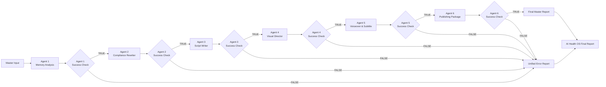

# AI Health OS V1 Architecture

AI Health OS V1 is a serial, state-preserving n8n workflow system. The Master Orchestrator invokes six callable Agent workflows and stops on the first failure.

## System flow

## Master Orchestrator role

The Master Orchestrator:

- Accepts the original content brief.
- Prepares Agent-specific inputs.
- Calls each Agent through n8n Execute Workflow nodes.
- Waits for each Agent to finish.
- Normalizes each Agent output.
- Preserves accumulated run state.
- Checks success after every Agent.
- Produces either a Unified Error Report or Final Master Report.

The Master does **not** perform Agent business logic.

## State preservation between Agents

The Master preserves these fields across the full chain:

- `workflow`
- `version`
- `master_run_id`
- `started_at`
- `topic`
- `product_name`
- `target_audience`
- `target_platform`
- `video_duration_seconds`
- `language`
- `brand_tone`
- `additional_requirements`
- `agent_1_output` through `agent_6_output`
- `agent_1_status` through `agent_6_status`

Each Normalize node merges the current Agent output with previously accumulated Master state.

## TRUE and FALSE branches

Each Success Check has two branches:

- **TRUE branch:** Continue to the next Agent or final report.
- **FALSE branch:** Stop the chain and route to Unified Error Report.

This prevents later Agents from running on incomplete or unsafe data.

## Unified Error Report

The Unified Error Report returns:

- Failed Agent.
- Failed step.
- Error message.
- Parse error if present.
- Last successful Agent.
- Raw output for debugging.
- Suggested action.

## Final Master Report

The Final Master Report returns:

- Overall `status = success`.
- Preserved Master metadata.
- Agent 1–6 execution statuses.
- Agent outputs.
- Final publishing packages from Agent 6.
- `ready_for_manual_publish`.
- A Chinese Markdown report.
- A human-review disclaimer.

## Agent responsibilities

| Agent | Responsibility |
|---|---|
| Agent 1 | Analyze memory/input topics and rank content opportunities. |
| Agent 2 | Rewrite or validate content for safer health-compliance language. |
| Agent 3 | Generate scripts suitable for short-form video. |
| Agent 4 | Create visual direction, storyboard, scene list, prompts, and style guidance. |
| Agent 5 | Generate voiceover script, subtitle segments, SRT, pacing notes, and subtitle QA. |
| Agent 6 | Generate publishing package, captions, hashtags, SEO, cover text, checklist, analytics template, and A/B test plan. |
